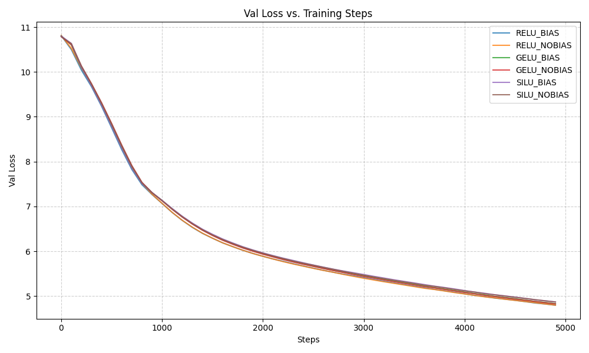
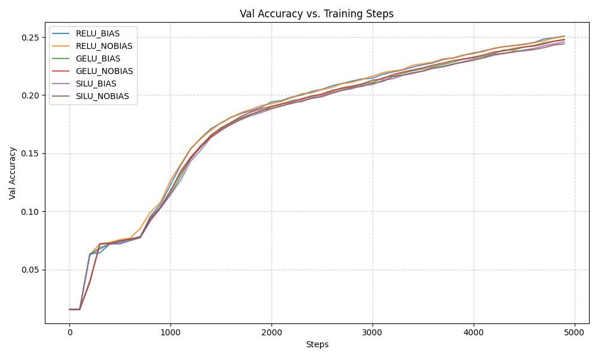
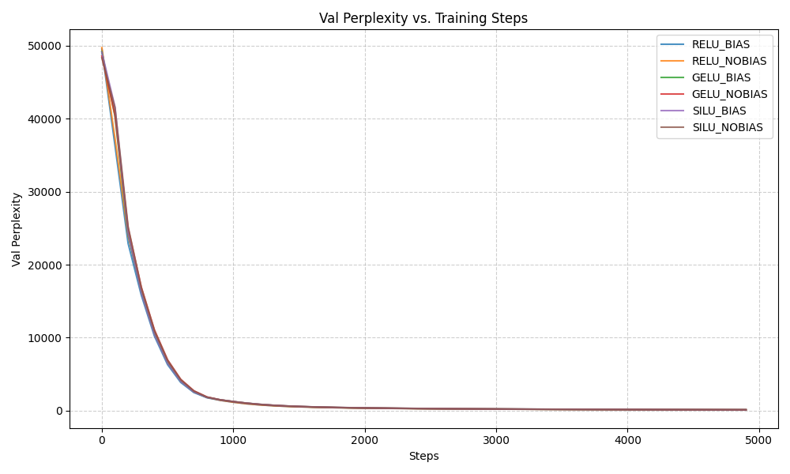

# Activation Function Comparison in Transformer Models

This project investigates the effects of different activation functions and the presence of attention bias in a small GPT-style transformer.

## 🔬 Experiment Overview

We compare the training dynamics and performance of three activation functions:

* **ReLU**
* **GELU**
* **SiLU**

Each was tested with and without attention bias in the transformer architecture.

### 🔧 Setup

* **Model:** GPT-style transformer

  * 6 layers, 8 heads, 384 hidden dimension
* **Dataset:** Subset of *Cosmopedia-v2* (500,000 tokens)
* **Training:**

  * 5,000 steps
  * Batch size: 12
  * Gradient accumulation: 4
* **Optimizer:** AdamW (lr = 1e-4, weight decay = 0.1)
* **Variants tested:** All combinations of `{ReLU, GELU, SiLU} × {Bias=True, Bias=False}`

## 📊 Results

Training and validation metrics were tracked for each variant:

* **Training Loss**
* **Validation Loss**
* **Validation Accuracy**
* **Validation Perplexity**

<p align="center">
  
  
  <br/>
  
  
</p>


Let's walk through **where the activation functions and attention bias are applied**:

---

## 🔧 1. **Activation Functions**

### **Where it's used:**

The activation function is applied **inside the FeedForward network**, specifically in the `FeedForward` class:

```python
class FeedForward(nn.Module):
    ...
    def __init__(..., activation: str = 'silu'):
        ...
        if activation.lower() == 'relu':
            self.activation = F.relu
        elif activation.lower() == 'gelu':
            self.activation = F.gelu
        elif activation.lower() == 'silu':
            self.activation = F.silu
    ...
    def forward(self, x):
        return self.linear2(self.dropout(self.activation(self.linear1(x))))
```

### **Applied in TransformerBlock:**

```python
class TransformerBlock(nn.Module):
    ...
    def __init__(..., activation: str = 'silu', ...):
        ...
        self.feed_forward = FeedForward(..., activation=activation, ...)
```

### ✅ So:

Each transformer block uses the **specified activation** (`relu`, `gelu`, or `silu`) **after the first linear projection in the FFN**.

---

## 🧠 2. **Attention Bias**

### **Where it's used:**

The attention bias affects whether the `nn.Linear` layers inside **QKV and output projections** have `bias=True`.

This is handled in the `MultiHeadAttention` class:

```python
class MultiHeadAttention(nn.Module):
    def __init__(..., use_attention_bias: bool = False):
        ...
        self.qkv = nn.Linear(d_model, d_model * 3, bias=use_attention_bias)
        self.w_o = nn.Linear(d_model, d_model, bias=use_attention_bias)
```

This means:

* If `use_attention_bias=True`, the QKV and output projection layers will have biases.
* If `False`, they will not.

### **Applied in TransformerBlock:**

```python
class TransformerBlock(nn.Module):
    def __init__(..., use_attention_bias: bool = False):
        ...
        self.attention = MultiHeadAttention(..., use_attention_bias=use_attention_bias)
```

---

## 🔁 Summary

| Component          | Parameter Source            | Effect Location                                 |
| ------------------ | --------------------------- | ----------------------------------------------- |
| **Activation**     | `config.activation`         | `FeedForward → activation(linear1(x))`          |
| **Attention Bias** | `config.use_attention_bias` | `MultiHeadAttention → nn.Linear(..., bias=...)` |


## 📈 Observations

While **GELU with attention bias** achieved the best final validation loss (4.7966), all activation functions performed similarly overall. There is no significant advantage for any single configuration based on this dataset and setup. Minor differences may reflect noise or dataset variance.

## 📌 Conclusion

There is no clearly superior activation function in this setting. For small transformer models on moderate data, **activation choice and attention bias may not drastically affect performance**—but deeper analysis or larger-scale experiments may reveal more nuanced behavior.