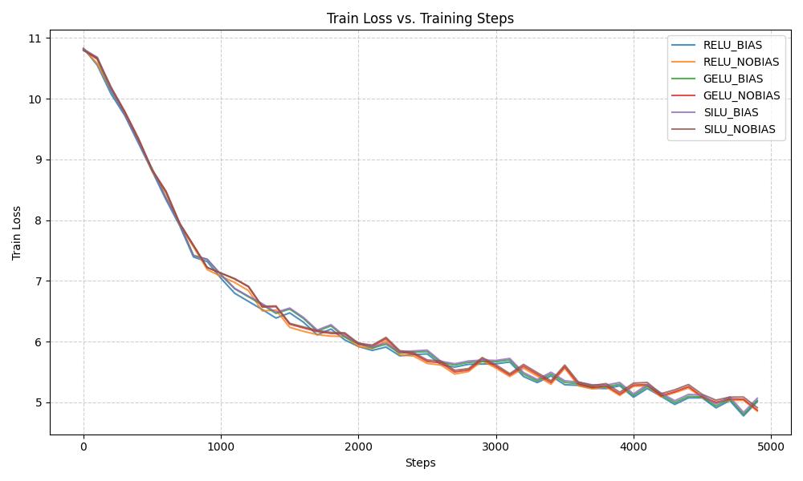

# Experiment Report: Activation Function Comparison

This report details an experiment comparing the performance of three different activation functions (ReLU, GELU, and SiLU) and the effect of attention bias within the feed-forward network and attention mechanism of a small transformer model.

## Experimental Setup

- **Model:** A minimal GPT-style model with 6 layers, 8 attention heads, and a model dimension of 384.
- **Dataset:** A subset of the Cosmopedia-v2 dataset, tokenized to a maximum of 500,000 tokens.
- **Training:** Each model variant was trained for 5000 steps with a batch size of 12 and gradient accumulation of 4.
- **Optimizer:** AdamW with a learning rate of 1e-4 and weight decay of 0.1.
- **Variable:** The activation function in the FFN and the presence of attention bias were changed for each run.

## Results

The following plots compare the training and validation metrics for each activation function across the training process.

### Training Loss Comparison

### Validation Loss Comparison

### Validation Accuracy Comparison

### Validation Perplexity Comparison

## Conclusion
Based on the final validation loss, **GELU_BIAS_TRUE** performed the best, achieving a validation loss of 4.7966. The experiments show that both activation functions and the presence of attention bias can influence model performance. Further analysis of the plots is recommended to understand the specific trade-offs and learning dynamics for each combination.